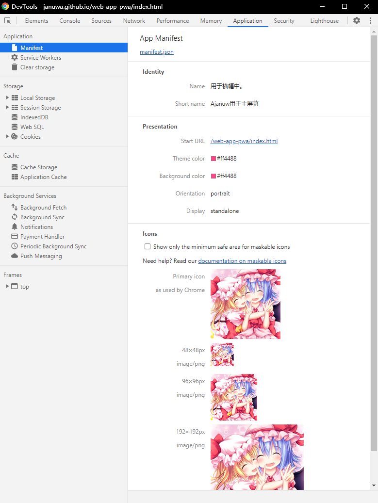

# web-app-pwa
测试PWA应用（必须使用https）

地址: [https://januwa.github.io/web-app-pwa/index.html
](https://januwa.github.io/web-app-pwa/index.html
) 在手机chrome中打开，添加到主屏

## 在Windwos

## 在Android

- 安装时

- 启动时

See also:
  - [使用渐进式Web应用程序](https://support.google.com/chrome/answer/9658361?co=GENIE.Platform%3DDesktop&hl=en)
  - 在[chrome://apps/](chrome://apps/)可以看到所有已安装的PWA引应用